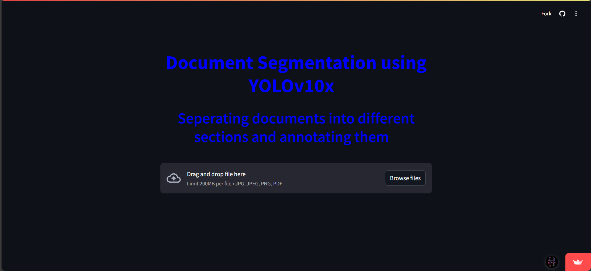
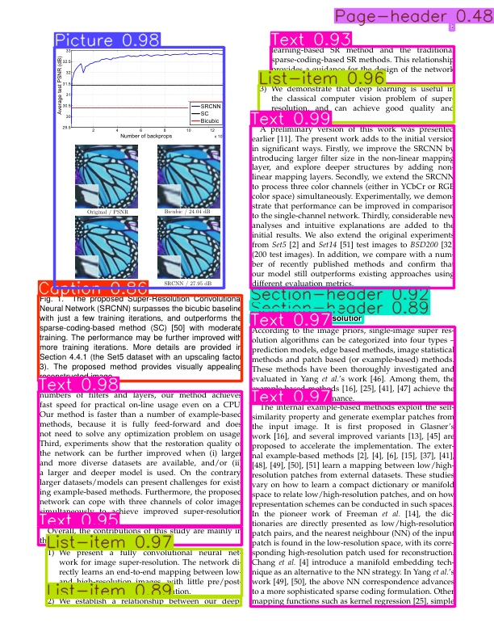
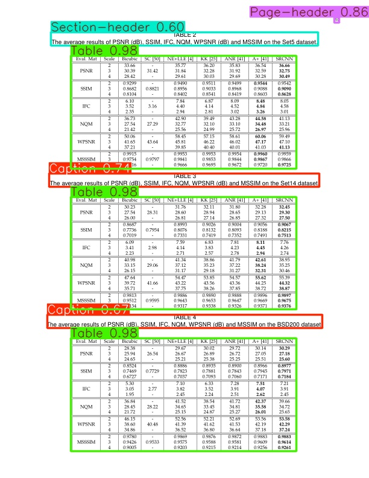

# YOLOv10 Document Segmentation Web-app

## Overview
A streamlit app for Document segmentation into different sections. 

This app uses the YOLOv10x model for document segmentation to annotate various sections of a document such as text-fileds, formulae, pictures, list-items,etc.
The model uses pretrained weights which may be dowloaded using this [colab notebook](ocrmain.ipynb)

[Link](https://yolodocument-kp8j7kfnsldrfa76ctpcug.streamlit.app/) for deployed web-application using streamlit

## Website Interface and Results

### Annotations on document

